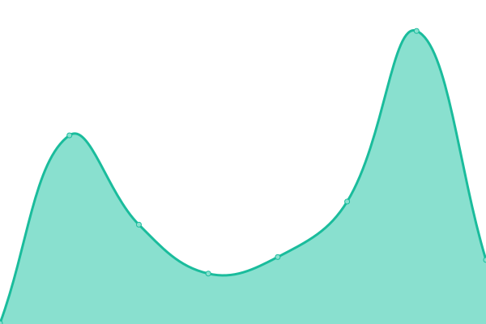
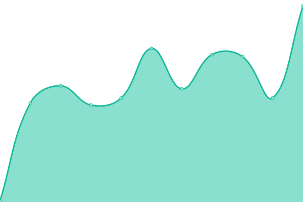
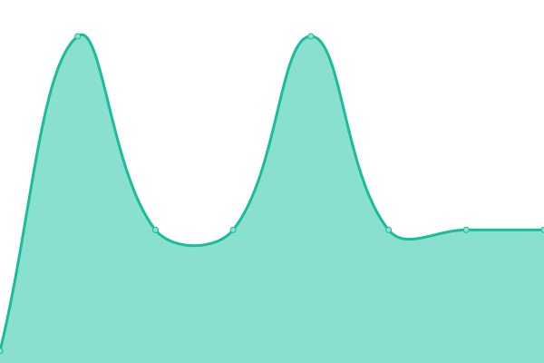
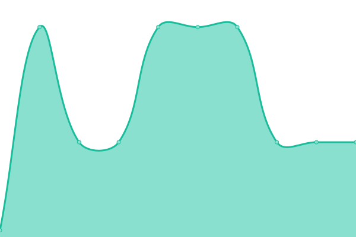

# [📈 Live Status](https://status.wommm.nl): <!--live status--> **🟩 All systems operational**

This repository contains the open-source uptime monitor and status page for [Martin Schut](https://gitlab.com/schutm), powered by [Upptime](https://github.com/upptime/upptime).

With [Upptime](https://upptime.js.org), you can get your own unlimited and free uptime monitor and status page, powered entirely by a GitHub repository. We use [Issues](https://github.com/schutm/personal-upptime/issues) as incident reports, [Actions](https://github.com/schutm/personal-upptime/actions) as uptime monitors, and [Pages](https://status.wommm.nl) for the status page.

<!--start: status pages-->
<!-- This summary is generated by Upptime (https://github.com/upptime/upptime) -->
<!-- Do not edit this manually, your changes will be overwritten -->
<!-- prettier-ignore -->
| URL | Status | History | Response Time | Uptime |
| --- | ------ | ------- | ------------- | ------ |
|  [Webmail](https://mail.meritieau.com) | 🟩 Up | [webmail.yml](https://github.com/schutm/personal-upptime/commits/HEAD/history/webmail.yml) | 

 89ms
     
 | 

<a href="https://status.wommm.nl/history/webmail">100.00%</a>
    

|  [Webmail (backup)](https://www.bhosted.nl/webmail) | 🟩 Up | [webmail-backup.yml](https://github.com/schutm/personal-upptime/commits/HEAD/history/webmail-backup.yml) | 

 183ms
     
 | 

<a href="https://status.wommm.nl/history/webmail-backup">100.00%</a>
    

|  [Mail (sending)](smtp.meritieau.com) | 🟩 Up | [mail-sending.yml](https://github.com/schutm/personal-upptime/commits/HEAD/history/mail-sending.yml) | 

 25ms
     
 | 

<a href="https://status.wommm.nl/history/mail-sending">100.00%</a>
    

|  [Mail (receiving)](pop3.wommm.nl) | 🟩 Up | [mail-receiving.yml](https://github.com/schutm/personal-upptime/commits/HEAD/history/mail-receiving.yml) | 

 38ms
     
 | 

<a href="https://status.wommm.nl/history/mail-receiving">100.00%</a>
    

<!--end: status pages-->

[**Visit our status website →**](https://status.wommm.nl)

## 📄 License

- Powered by: [Upptime](https://github.com/upptime/upptime)
- Code: [MIT](./LICENSE) © [Anand Chowdhary](https://anandchowdhary.com), supported by [Pabio](https://pabio.com)
- Data in the `./history` directory: [Open Database License](https://opendatacommons.org/licenses/odbl/1-0/)
